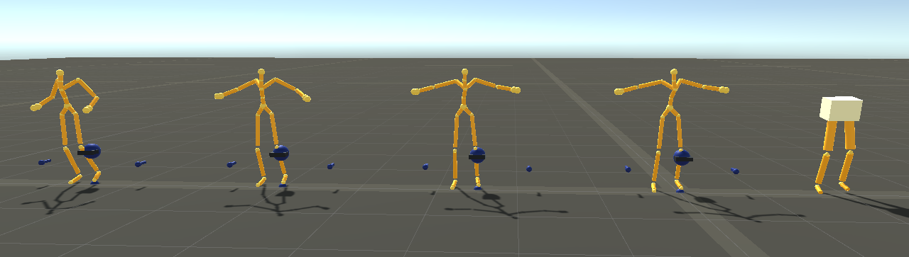

# LearnLowerBody

Research for lower body generation using imitation learning using PPO. I made use of Unity [ML-Agents](https://github.com/Unity-Technologies/ml-agents) to create reinforcement learning environment for lower body locomotion generation that follows kinematic motion. This repository reproduced results of two papers (DeepMimic, Learning Simulate and Predict) which are mentioned at the reference part.

### Preview

### How to train & How to play trained model

#### Prerequisites
1) Recommend creating virtual environment 
2) Download Unity ML Agents version higher than 1.8.0 [ML-Agents](https://github.com/Unity-Technologies/ml-agents)
3) Unity Version Higher than 2020.2.7 (Highly possible that lower version will work though)

#### Sample Data
We used only one data to train(m_LocomotionFlat01_000_local.csv) since it includes variety of movement including sudden turn, run and walk,

#### Training
1) Build the project with the number of environment that you want. Or you can simply run directly through UI which will be much slower though.
2) Once build, copy and paste Asset/Animation folder under the generated build location.
3) navigate to ML agent run the ml agents command which will be look something like
mlagents-learn <trainer-config-file> --env=<env_name> --run-id=<run-identifier> 
4) If you use executable, using --no-graphics will faster the training speed.

#### Some details

1.	The reference papers used the “stable pd controller”[Stable Proportional-Derivative Controllers](https://www.cc.gatech.edu/~turk/my_papers/stable_pd.pdf) specially designed for humanoid character motion. This implementation the spherical linear interpolation (Slerp) drive method that considers entire local axes for rotating a joint.

2.	There is limit for each joint angle that will accord to normal human joint. For example, knee angle will not go more than 120 degree etc. 

3.	I used 32-core machine. I used 8 agents in one environment and 16 executables at the same time for training.

#### Training time bottleneck
It seems like the time for parameter sharing between agents or executables became too large that eventually acted as a bottleneck.

### Current Limitation
In current implementation version, the agent fails when turning after forward locomotion.

### Contributor
Taehei Kim [Hayleymol](https://github.com/Hayleymol)

### References
This repository contains code for reproducing the papers [DeepMimic: Example Guided Deep Reinforceme nt Learning of Physics Based Character Skills Skills](https://arxiv.org/abs/1804.02717) in Unity Engine. To deal with the longer length ((≈90 sec, ≈5 sec for DeepMimic) and diverse categories of reference motion clips, we adopted the two step method of motion generator and tracking controller, introduced in [Learning predict and simulate policies from unorganized human motion data](https://dl.acm.org/doi/pdf/10.1145/3355089.3356501).

